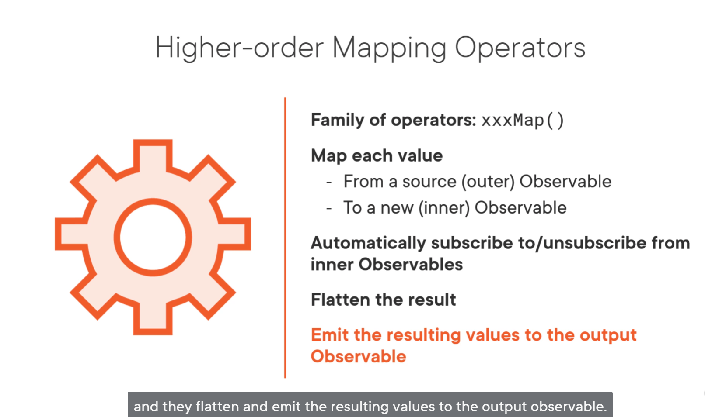
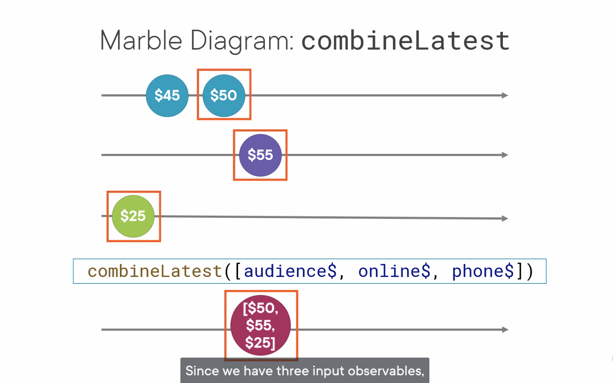

# observables emit observables

任何可以 emit an observable 的 observable 就叫 high-order observable 


问题1：inner observable 也需要 subscribe，unsubscribe，handle error


问题2：返回值是高阶 observable，导致在页面上无法直接使用 async pipe 自动 update emit value


使用高阶 mapping operators 解决问题


高阶 mapping operators  xxxMap() 自动从 inner observable subscribe 和 unsubscribe 



# concatMap

## 是什么

concatMap 是可以在 pipe 中使用的  transformation high-order mapping operator

```typescript

a$.pipe(
    concatMap((item) => of(item)));

```

## 机制

高阶映射加串联，接收到 outer observable 的 emit items，并 buffered，根据指定的 function 对每一个 item 构成新的 inner observable，自动 subscribe，等待其 complete 后，再依次处理下一个 outer observable 的 emit item。整个过程类似接力赛，依序等待上一个完成后再执行下一个

注意，传递给高阶映射运算符的函数，即提供的 function 必须返回一个 observable，或 RxJS 知道如果从中创建 observable


## 举例


## 什么时候完成

output observable complete 并且 inner observeable 全部 complete 时 complete

## 适用场景

concatMap 用于等待前一个 observable 完成后，再开始下一个 observable。并按顺序处理。注意，在此过程中用户可能会在显示中看到延迟，因为每个请求/响应都是按顺序处理的。

例如，有一组 Top 10 热门产品的 id，希望按照顺序检索和显示该数据；有一组需要更新或删除的数据，希望确保每个更新在开始下一个更新之前完成


## 不适用场景

## 总结


## 代码

```ts

suppliersWithConcatMap$ = of(1, 5, 8).pipe(
    tap(item => console.log(`item: ${item}`)),
    concatMap( id => {
      console.log(`id: ${id}`);
      return this.http.get<Supplier>(`${this.suppliersUrl}/${id}`);
    } 
))
  
constructor(private http: HttpClient) { 
    this.suppliersWithConcatMap$.subscribe(
        data=>console.log(data)
    )
}

```

结果：

```
item: 1
id: 1
item: 5
item: 8
{id: 1, name: 'Acme Gardening Supply', cost: 16.95, minQuantity: 12}
id: 5
{id: 5, name: 'Acme General Supply', cost: 2, minQuantity: 24}
id: 8
{id: 8, name: 'Acme Tool Supply', cost: 4, minQuantity: 12}
```

# mergeMap 

## 是什么

mergeMap 是可以在 pipe 中使用的 transformation higher-order mapping operator

```typescript

a$.pipe(
    mergeMap((item) => of(item))
);

```

## 机制

高阶映射加合并，拿到 outer observable emit 的 item，根据提供的 function 转换成 inner observable，并行 subscribe inner observable 和 unsubscribe，然后 merge 他们的 results

注意，传递给高阶映射运算符的函数，即提供的 function 必须返回一个 observable，或 RxJS 知道如果从中创建 observable


## 举例

当 A1 emit 出来，mergeMap 立即根据给定的 function，生成 innerObservable，并订阅


当 A2 emit 出来，mergeMap 立即执行和上面一样的步骤。当响应返回时，数据直接被 merge 到 output observable


inner observable 按照谁先执行完谁先 emit 结果到 output observable


## 什么时候完成

output observable complete 并且 inner observeable 全部 complete 时 complete

## 适用场景

mergeMap 用于可以并行处理 inner observable 的情形。注意，在此过程中 output observable 的结果和 outer observable 的不一定一致

例如，有一组 ID，用这组 ID 来检索数据，且顺序无关紧要


## 不适用场景

## 总结


## 代码

```ts

suppliersWithMergeMap$ = of(1, 5, 8).pipe(
    tap(item => console.log(`mergeMap source observable item: ${item}`)),
    mergeMap( id => {
      console.log(`mergeMap inner observable item id: ${id}`);
      return this.http.get<Supplier>(`${this.suppliersUrl}/${id}`);
    })
)
  
constructor(private http: HttpClient) { 
    this.suppliersWithMergeMap$.subscribe(
      item => console.log('mergeMap result', item)
    )
}

```

结果：

```

mergeMap source observable item: 1
mergeMap inner observable item id: 1
mergeMap source observable item: 5
mergeMap inner observable item id: 5
mergeMap source observable item: 8
mergeMap inner observable item id: 8
mergeMap result {id: 1, name: 'Acme Gardening Supply', cost: 16.95, minQuantity: 12}
mergeMap result {id: 5, name: 'Acme General Supply', cost: 2, minQuantity: 24}
mergeMap result {id: 8, name: 'Acme Tool Supply', cost: 4, minQuantity: 12}

```

# switchMap

## 是什么

switchMap 是可以在 pipe 中使用的 transformation higher-order mapping operator

```typescript

a$.pipe(
    switchMap ((item) => of(item))
);

```

## 机制

高阶映射加切换，switchMap 一次只订阅一个 inner observable。拿到 outer observable emit 的 item，根据提供的 function 转换成 inner observable，如果在这个 inner observable complete 之前，outer observable 又 emit 了新的 value，立马丢弃掉前一个 inner observable，生成新的 inner observable，得到的 results 输出到 output observable。

注意，传递给高阶映射运算符的函数，即提供的 function 必须返回一个 observable，或 RxJS 知道如果从中创建 observable


## 举例


## 什么时候完成

input observable complete and 最后一个 inner observable complete 时 complete

## 适用场景

switchMap 用来切换下一个 observable，停止之前的 observable 的场景。

例如输入提示或自动补全，或用户多次点击 selection filter 等

## 不适用场景

## 总结

 

##  代码

```ts

suppliersWithSwitchMap$ = of(1, 5, 8).pipe(
    tap(item => console.log(`switchMap source observable item: ${item}`)),
    switchMap( id => {
      console.log(`switchMap inner observable item id: ${id}`);
      return this.http.get<Supplier>(`${this.suppliersUrl}/${id}`);
    })
)

constructor(private http: HttpClient) { 
    this.suppliersWithSwitchMap$.subscribe(
      item => console.log('switchMap result', item)
    )
 }

```

结果：

```
switchMap source observable item: 1
switchMap inner observable item id: 1
switchMap source observable item: 5
switchMap inner observable item id: 5
switchMap source observable item: 8
switchMap inner observable item id: 8
switchMap result {id: 8, name: 'Acme Tool Supply', cost: 4, minQuantity: 12}
```

# 总结


用高阶 mapping operators 取代嵌套订阅


## use case


# 模板

## 是什么

filter 是可以在 pipe 中使用的 transformation operator

```typescript
a$.pipe(filter((item) => item === 1));
```

## 机制

过滤所有的 input observable items 满足给定的 function 时，才会 emit 出去



## 举例

## 什么时候完成

## 适用场景

## 不适用场景

## 总结
